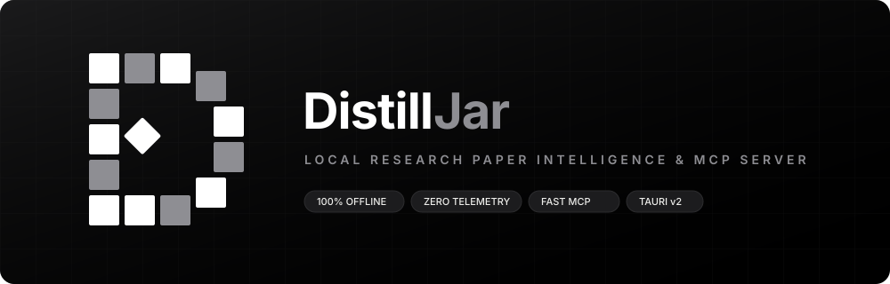

<p align="center">
  
</p>

<p align="center">
  <strong>Offline research paper intelligence workspace and Model Context Protocol (MCP) server.</strong><br>
  Built with Tauri v2, Microsoft MarkItDown, and local Ollama inference.
</p>

---

## Overview

DistillJar converts academic papers and technical documents into atomic-fact knowledge matrices. It runs entirely on-device with zero telemetry, no user accounts, and no cloud dependencies.

Key capabilities:
- Document Ingestion: Uses Microsoft MarkItDown to preserve tables, headings, and formulas from PDF, DOCX, PPTX, XLSX, and TXT files.
- 1-Tap arXiv & DOI Ingest: Paste any arXiv URL or ID to download, extract, and index papers directly via a loopback proxy.
- Spotlight Command Palette (⌘K / Ctrl+K): Fast search across papers, actions, and view switching.
- Interactive Citation Jumps: Tap any cited page badge ([Page X]) to scroll and flash-highlight the exact page chunk.
- Distillation: Generates structured executive summaries and knowledge matrices via local LLMs (Ollama).
- Model Context Protocol (MCP): Exposes your local document vault directly to Claude Desktop, Cursor, and autonomous AI agents.
- Lightweight Desktop Engine: Built with Tauri v2 (~12MB binary) using native OS webviews instead of Chromium.
- High-Capacity Vault: Backed by IndexedDB and local filesystem storage (`~/.distilljar/vault/`).

## Quick Start

### Web Application

```bash
# Clone repository
git clone https://github.com/jaswanthsanjay88/DistillJar.git
cd DistillJar/summarijar

# Install dependencies
npm install

# Start development server
npm run dev
```

The application runs locally at `http://localhost:3000`.

### Desktop Application

Download pre-built binaries for macOS (`.dmg`), Windows (`.exe` / `.msi`), and Linux (`.AppImage` / `.deb`) from the Releases page:
https://github.com/jaswanthsanjay88/DistillJar/releases

To build from source:

```bash
npm run tauri:build
```

### Keyboard Shortcuts

| Shortcut | Action |
| :--- | :--- |
| `⌘K` / `Ctrl+K` | Open Spotlight Command Palette |
| `⌘O` / `Ctrl+O` | Open file picker to upload document |
| `⌘1` / `⌘2` / `⌘3` | Switch between Summary, Matrix, and Pages |
| `⌘,` / `Ctrl+,` | Open Settings & MCP modal |
| `⌘Enter` / `Ctrl+Enter` | Send question in Assistant pane |

### Model Context Protocol (MCP) Server

Connect DistillJar to Claude Desktop or Cursor:

```json
{
  "mcpServers": {
    "distilljar": {
      "command": "python3",
      "args": [
        "/path/to/distilljar/mcp_server.py"
      ]
    }
  }
}
```

*Note: On Windows, set `"command": "py"` or `"python"`.*

#### Exposed MCP Tools

| Tool | Description |
| :--- | :--- |
| `list_library_papers` | Lists all documents indexed in the local vault. |
| `get_paper_knowledge_matrix` | Retrieves the atomic-fact matrix for a specific paper. |
| `query_paper_rag` | Runs private semantic search and RAG synthesis via local Ollama. |
| `get_page_chunks` | Returns exact verbatim Markdown chunks with page citations. |
| `ingest_new_paper` | Ingests a new document via Microsoft MarkItDown into the vault. |
| `extract_url_citation` | Structured citation extraction from external URLs via ScrapeGraphAI with zero telemetry. |
| `search_and_extract_web` | Searches academic sources via SearXNG and extracts structured findings. |

### Python Backend & Sidecar

```bash
# Start FastAPI backend service (port 8000)
python3 -m uvicorn main:app --host 0.0.0.0 --port 8000

# Run batch PDF CLI summarizer
python3 pdf_process.py
```

## Privacy & Security

- All inference executes over local loopback (`localhost:11434`).
- Document data is stored locally in `~/.distilljar/vault/` and browser IndexedDB.
- Zero analytics, telemetry, or external network requests (`SCRAPEGRAPHAI_TELEMETRY_ENABLED=false`).

## License

MIT License. See LICENSE for details.